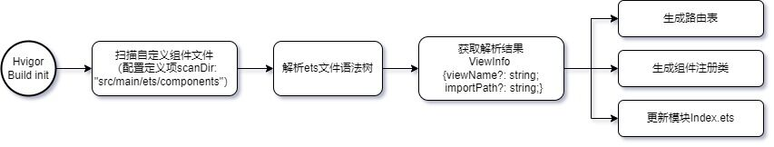

# 为鸿蒙应用 Navigation 组件自动生成系统路由表

从 API 12开始，Navigation 支持使用系统路由表的方式进行动态路由。通过配置在工程 resources/base/profile 中创建 router_map.json 文件就可以实现跳转。

但是，仍然需要手动为路由的目标页面编写配置文件和 Build 函数，较为繁琐。使用该插件，仅用一个注解即可帮你完成上述的配置操作。

## 实现原理

该插件在编译时会扫描指定目录下的所有 ets 文件中的 @AppRouter 组件，并为组件生成对应的系统路由表配置文件和 Build 函数。



## 使用方式

1. 从最新的 Release 种下载本仓库中的压缩产物 AutoGenRouterMap.tgz，放置到项目的 plugin 目录下

2. 修改项目的 hvigor/hvigor-config.json 文件，导入插件

```json
{
  "dependencies": {
    "@app/ets-generator" : "file:../plugin/AutoGenRouterMap"
  }
}
```

3. 在各个模块的 hvigorfile.ts 文件中配置 扫描范围

```typescript
import { hspTasks } from '@ohos/hvigor-ohos-plugin';
import { PluginConfig, etsGeneratorPlugin } from '@app/ets-generator';


// 配置路由信息
const config: PluginConfig = {
    // 扫描文件的路径
    scanDir: "src"
}

export default {
    system: hspTasks, /* Built-in plugin of Hvigor. It cannot be modified. */
    plugins: [etsGeneratorPlugin(config)]         /* Custom plugin to extend the functionality of Hvigor. */
}
```

4. 在各模块的 module.json5 中配置系统路由表路径

```json
{
  "module": {
    "routerMap": "$profile:router_map"
  }
}
```

5. 在你项目的最底层的 common 模块中（需要放置路由 NavDestination 的模块必须都已经依赖了 common 模块），创建并导出 AppRouter 装饰器的声明

```typescript
// 自定义装饰器
export function AppRouter(param: AppRouterParam) {
  return Object;
}

// 装饰器参数
export interface AppRouterParam {
  // 跳转的路由名
  name: string;
}
```

```typescript
export { AppRouter } from './src/main/ets/annotation/AppRouter'
```

6. 使用时，只需要给组件添加 @AppRouter({ name: '[PAGE_NAME]' }) 即可

```typescript
import { AppRouter } from 'common/Index';

export const GLOBAL_PAGE_STACK = 'pageStack'

@AppRouter({ name: 'NavigationPage' })
@Component
export struct NavigationPage {
  // 创建一个页面栈对象并传入Navigation
  pageStack: NavPathStack = AppStorage.get(GLOBAL_PAGE_STACK) as NavPathStack

  build() {
    NavDestination() {
      Text('Page')
      Button('Return')
        .onClick(() => {
          this.pageStack.pop()
        })
    }
    .hideTitleBar(true)
  }
}
```

## 生成产物

执行编译后，会在项目目录中自动生成 generated 目录，其中的 RouterBuilder.ets 文件中就包含了 Navigation 所需的页面 Builder 函数。

```typescript
import { NavigationPage3 } from '../pages/navigation/NavigationPage'

@Builder
export function navigationPageBuilder() {
  NavigationPage();
}
```

在 src/main/resources/base/profile/router_map.json 中生成对应的页面配置。

```json
{
  "routerMap": [
    {
      "name": "NavigationPage",
      "pageSourceFile": "src/main/ets/generated/RouterBuilder.ets",
      "buildFunction": "navigationPageBuilder",
      "data": {
        "description": ""
      }
    }
  ]
}
```

## 编译方式

```shell
cd node_modules/.bin
tsc
```

打 tgz 包

```shell
tar -czvf AutoGenRouterMap.tgz --exclude='AutoGenRouterMap/.git' --exclude='AutoGenRouterMap/node_modules' --exclude='AutoGenRouterMap/src' AutoGenRouterMap
```

## 参考

在原[自定义路由表方案](https://gitee.com/harmonyos-cases/cases/tree/master/CommonAppDevelopment/common/routermodule)的基础上

- 剥离了自动生成路由表文件和 Builder 文件的部分
- 生成规则和系统路由表进行对齐
- 优化了扫描路径配置，支持传入文件夹进行递归扫描

